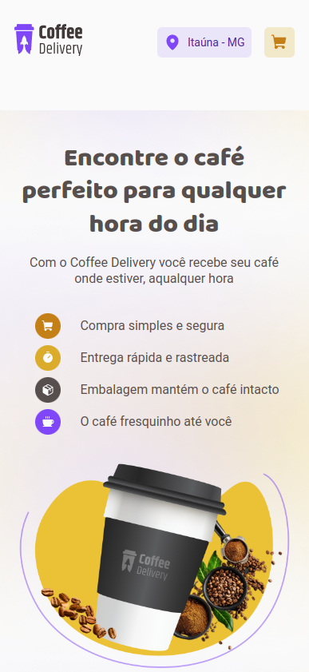
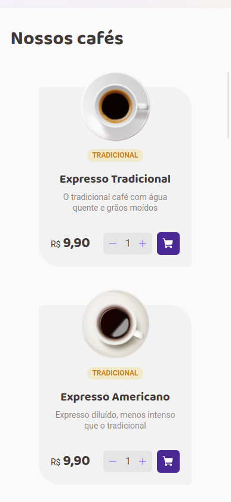
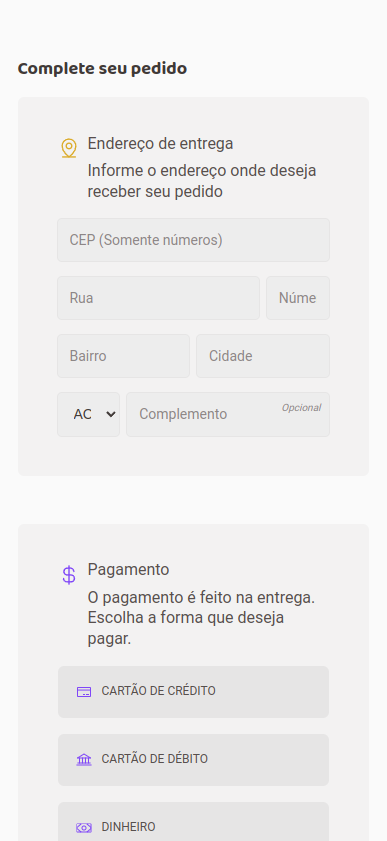
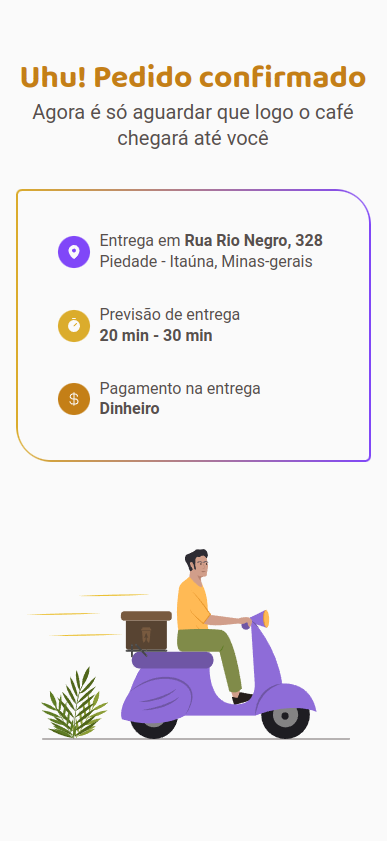

# Coffee Delivery

      |  
:-------------------------:|:-------------------------:
:      |  

<a href="https://damasio-coffee-delivery.netlify.app" target="_blank">Live Project 👽</a>
        
## About the project 💻
This is a challenge from the second chapter of Rocketseat's Ignite classes.

Users should be able to:
- Navigate through the 3 different pages (Home, Checkout, Success)
- Add new coffee orders to the cart
- Increment and decrement the quantity of each coffee type limited by the maximum amount of coffee in the inventory through both the Home page and the Checkout page
- Once typed all necessary information in the Checkout page form and submit the form, see the success page with the message about their order

Tecnologies I'm using:
- Vite
- React.js
- TypeScript

Libraries:
- styled-components
- react-router-dom
- React Hook Form
- Phosphor Icons

## Things I added to this project 👨‍💻
The best way to learn is to make projects yourself (as I'm doing now 🙃) and to try to add cool features to those projects.

Some features I added:
- When user enters CEP number, form will fill some address fields by itself
- Geolocalization API to get user location and show it on the header 
- Responsive design (mobile-first workflow)

## Difficulties I faced 🤷‍♂️
### TypeScript 
Integrating this projects libraries with TypeScript was a challenging task as this is only my second React app using TypeScript
For me it's been a difficult problem to deal with, but I'm seeing improvements in the way I use and understand TypeScript

#### react-router-dom 
This is my first project using this library by myself and I found myself very confused and lost in the beginning trying understand concepts like:
- Router
- Outlet
- How to redirect user throughout the website as a side effect of an action

But, as soon as I slowed down and searched through the documentation I found what I needed better understand the library and build my project

### Context API 
Understanding how to work with data across different pages was a interesting challenge
It helped me learn more about:
- How to pass states and manipulate them outside of a given file
- How React Closures work when it comes to useState() (I really lost some time trying to fix these errors 😂)

## Things I could do to build a better project 👨‍🏭
1. Better separate the styles of the components in the styled-components files (already done that 🙃)
2. Thinking about TypeScript's types before writing functions and react components
3. Thinking about how form validation will work, and how to display error messages before actually writing the form

## What I learned 👨‍🏫
- How to better plan the structure (HTML), styles (CSS) and functionalities (JS) of an application by looking at a design/mockup
- How to think in a 'React way' (passing props, immutability, callback functions and etc)
- How to use TypeScript with React (still have to work in this tho)
- How to use React Hook Form to improve form accessibility, form control, validation and submition.
- How to use styled-components to write clean and dinamic styles in an application
- How to use react-router-dom to make a multi-page SPA 
- How to use the useEffect hook to consume API
- How get the user location using JavaScript geolocation + BigDatCloud geolocation API
